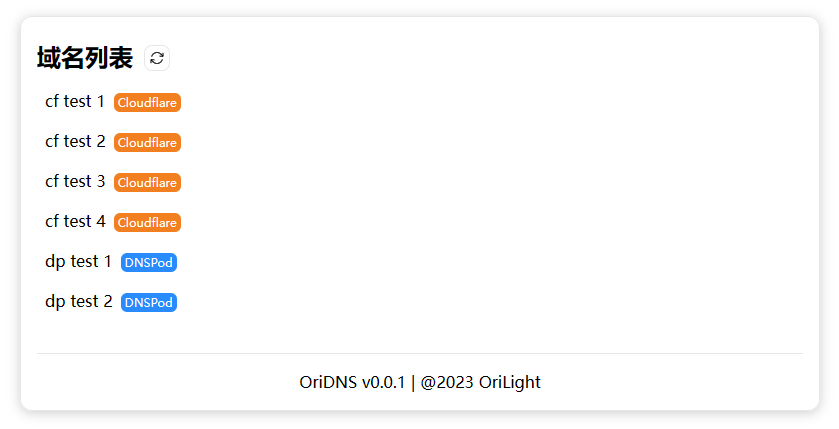

# OriDNS

自用 DNS 记录管理工具，支持添加多个账号，目前仅支持 DNSPod 和 Cloudflare

登录验证比较简陋，如要部署到公网上建议增加安全措施

## 预览

## 部署

### 前端

前后端分离，前端需要自行打包部署到到 Web 服务器上

1. 进入 `frontend` 文件夹
2. 更改 `src/config/index.ts` 文件中的服务端地址
3. 执行 `yarn && yarn build`
4. 将 `dist` 文件夹内的文件部署至 Web 服务器

### 后端

首先按照 `config.example.json` 格式填写配置并保存为 `config.json` 文件

**使用 Docker 部署**

填写 `docker-compose.yml` 文件内的环境变量等配置，使用 `docker compose up -d` 启动

**直接运行**

> 注意 gunicorn 无法在 Windows 上运行，如有需要请自行替换为其他 WSGI 服务器

1. 执行 `pip install -r requirements.txt`
2. 执行 `gunicorn -b 0.0.0.0:3000 main:app`
